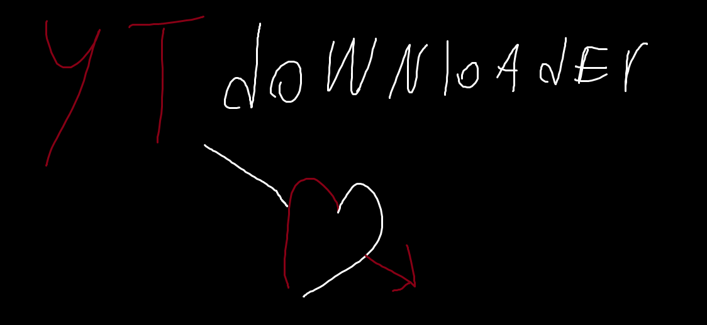
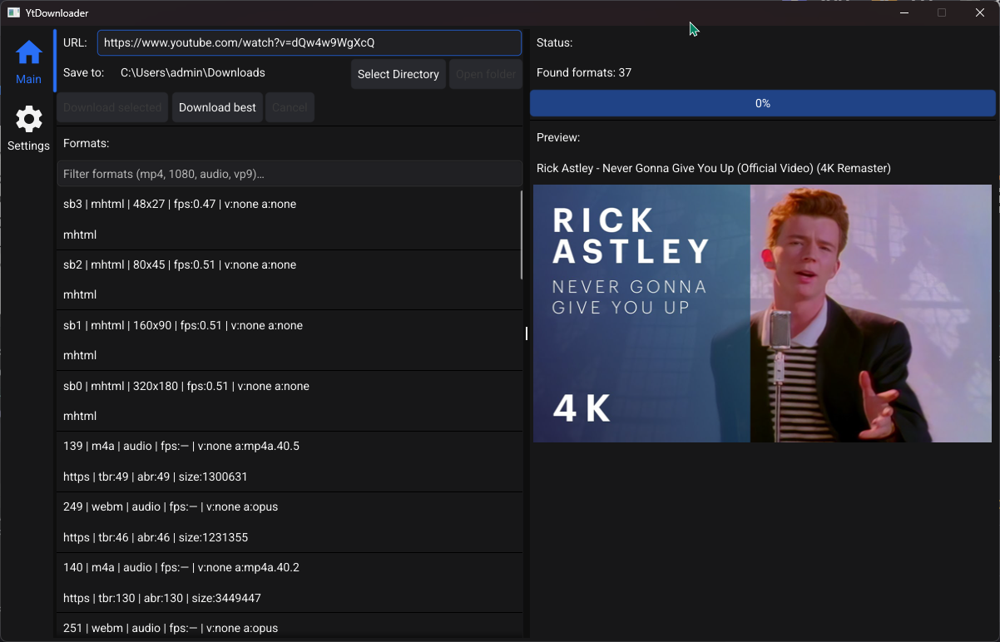

# YtDownloader

**YtDownloader** — небольшое GUI-приложение для скачивания видео/аудио через **yt-dlp** с использованием **FFmpeg** для объединения потоков/обработки.

---

## 🇷🇺 Русский

### Возможности
- Получение списка форматов и выбор нужного.
- Скачивание “best” (лучшее качество) или выбранного формата.
- Превью (thumbnail) и лог выполнения.
- Автоматическая загрузка внешних инструментов (yt-dlp / FFmpeg) при первом запуске или по кнопке **Update tools**.

### Куда скачиваются инструменты (Windows)
Приложение хранит внешние бинарники в каталоге пользователя (не рядом с `.exe`), чтобы не требовались права администратора.

По умолчанию используется `UserCacheDir`:
- `C:\Users\<USER>\AppData\Local\<APP_NAME>\bin\`

Если `UserCacheDir` недоступен — fallback на `UserConfigDir`:
- `C:\Users\<USER>\AppData\Roaming\<APP_NAME>\bin\`

Где:
- `<APP_NAME>` = `YtDownloader`

Внутри создаются файлы:
- `yt-dlp.exe`
- `ffmpeg.exe`
- `ffprobe.exe`
- `update_state.json` (служебный файл, чтобы не проверять обновления слишком часто)

Логи приложения (если включено логирование в коде) обычно лежат в `UserConfigDir`:
- `C:\Users\<USER>\AppData\Roaming\YtDownloader\logs\app.log`

### Лицензии и сторонние компоненты
Этот репозиторий содержит исходный код YtDownloader. Во время работы приложение может скачивать и использовать сторонние инструменты:

- **yt-dlp**  
  Автор/проект: yt-dlp contributors  
  Репозиторий: https://github.com/yt-dlp/yt-dlp  
  Лицензия: The Unlicense (код проекта).  
  Примечание: некоторые релиз-артефакты (например, Windows `.exe`) могут включать компоненты под другими лицензиями (в т.ч. GPLv3+). См. licensing notes и `THIRD_PARTY_LICENSES.txt` в релизах yt-dlp.

- **FFmpeg**  
  Автор/проект: FFmpeg developers  
  Сайт: https://ffmpeg.org/  
  Лицензия: LGPL или GPL — зависит от конкретной сборки и включённых компонентов. См. юридическую страницу FFmpeg: https://www.ffmpeg.org/legal.html  
  Windows сборки (если используется этот источник): https://github.com/BtbN/FFmpeg-Builds  
  Примечание: приложение может скачивать вариант сборки `win64-gpl-shared` (в зависимости от конфигурации/кода).

- **Fyne (GUI)**  
  Автор/проект: Fyne authors  
  Репозиторий: https://github.com/fyne-io/fyne  
  Лицензия: BSD 3-Clause

---

## 🇬🇧 English

### Features
- Fetches available formats and lets you pick one.
- “Best quality” download or selected format download.
- Thumbnail preview and execution logs.
- Automatically downloads external tools (yt-dlp / FFmpeg) on first run or via the **Update tools** button.

### Where tools are downloaded (Windows)
The app stores external binaries in the user profile (not next to the `.exe`) to avoid requiring admin rights.

Default location uses `UserCacheDir`:
- `C:\Users\<USER>\AppData\Local\<APP_NAME>\bin\`

Fallback uses `UserConfigDir`:
- `C:\Users\<USER>\AppData\Roaming\<APP_NAME>\bin\`

Where:
- `<APP_NAME>` = `YtDownloader`

Files created inside:
- `yt-dlp.exe`
- `ffmpeg.exe`
- `ffprobe.exe`
- `update_state.json` (internal file to avoid checking updates too often)

App logs (if file logging is enabled in code) are typically stored under `UserConfigDir`:
- `C:\Users\<USER>\AppData\Roaming\YtDownloader\logs\app.log`

### Licenses & third-party software
This repository contains the source code of YtDownloader. At runtime the app may download and use third-party software:

- **yt-dlp**  
  Author/project: yt-dlp contributors  
  Repository: https://github.com/yt-dlp/yt-dlp  
  License: The Unlicense (project code).  
  Note: some release artifacts (e.g., Windows `.exe`) may include components under other licenses (including GPLv3+). See upstream licensing notes and `THIRD_PARTY_LICENSES.txt` in yt-dlp releases.

- **FFmpeg**  
  Author/project: FFmpeg developers  
  Website: https://ffmpeg.org/  
  License: LGPL or GPL depending on build configuration and enabled components. See: https://www.ffmpeg.org/legal.html  
  Windows builds source (if used): https://github.com/BtbN/FFmpeg-Builds  
  Note: the app may download the `win64-gpl-shared` build variant depending on configuration/code.

- **Fyne (GUI)**  
  Author/project: Fyne authors  
  Repository: https://github.com/fyne-io/fyne  
  License: BSD 3-Clause

---
